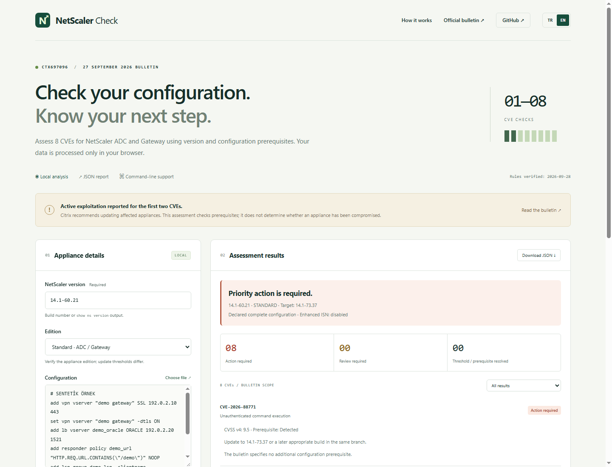
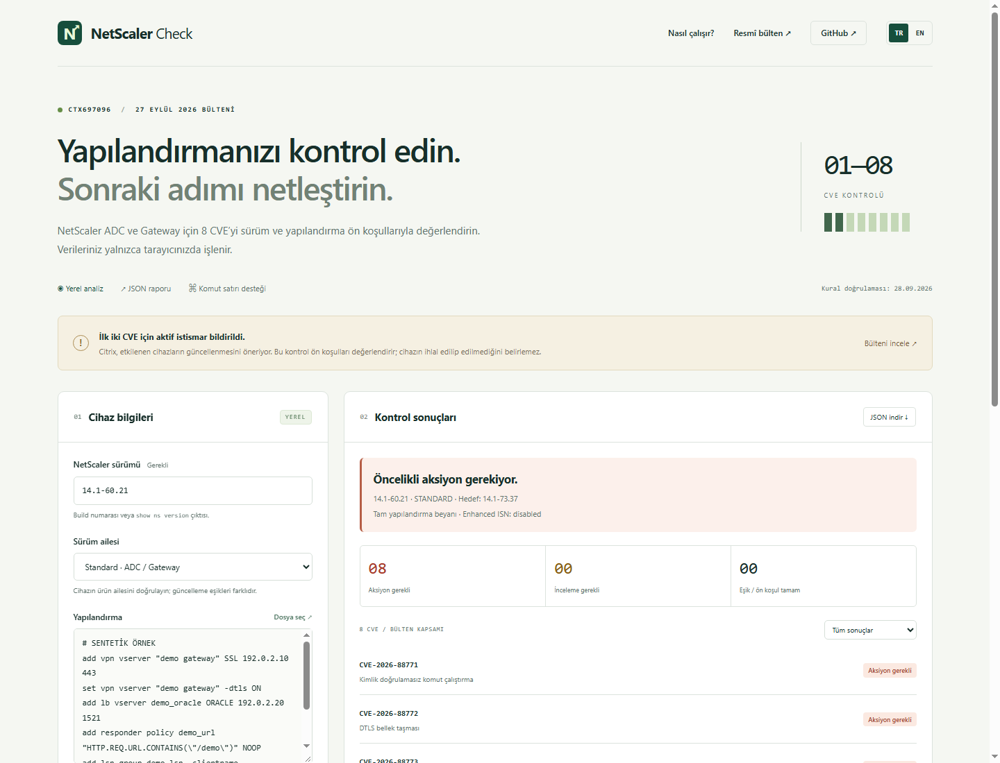
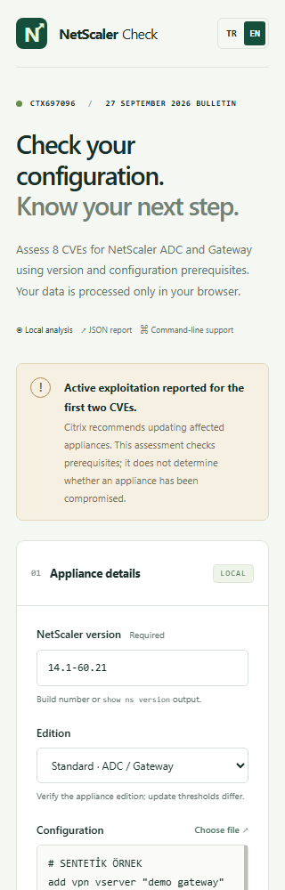

# NetScaler Check

Offline version and configuration assessment for **Citrix NetScaler ADC / Gateway — CTX697096, CVE-2026-88771 through CVE-2026-88778**.

A bilingual **English / Turkish** web interface and a dependency-free Node.js CLI share the same assessment engine. Analyze configuration exports locally, inspect findings and export a JSON report.

**[Open in English](https://emrecantuzer.github.io/netscaler-check/?lang=en)** · **[Türkçe aç](https://emrecantuzer.github.io/netscaler-check/?lang=tr)** · **[Official bulletin](https://support.citrix.com/external/article/CTX697096)**

Also included: **[NetScaler kernel-focused live triage collector](scripts/netscaler_kernel_triage.sh)** for collecting on-appliance investigation evidence. See [Live triage collector](#live-triage-collector) for usage and limitations.



## Features

- Assess all eight CVEs using version thresholds and configuration prerequisites.
- Select the correct Standard, FIPS or NDcPP edition.
- Inspect evidence line numbers and recommended actions for each finding.
- Switch between English and Turkish without losing inputs, results or filters.
- Download a JSON report with descriptions in the selected web language.
- Run assessments entirely in your browser or through the local CLI.
- Keep missing or ambiguous evidence visible as **Review required**.

This tool assesses customer-managed appliances. It does not connect to appliances, send DTLS probes, run exploits or change configuration. A prerequisite match is not evidence of compromise; meeting a fixed-build threshold does not rule out earlier exploitation.

## Screenshots

All screenshots use synthetic example data.

### Turkish desktop interface



### Mobile interface



## Quick start

### Web interface

Open the **[live application](https://emrecantuzer.github.io/netscaler-check/?lang=en)** and select **Try sample data**, or enter your appliance version and configuration export.

To run the site locally, install **Node.js 22 or later** and execute:

```sh
git clone https://github.com/emrecantuzer/netscaler-check.git
cd netscaler-check
node scripts/serve.cjs
```

Open [localhost:4173/?lang=en](http://127.0.0.1:4173/?lang=en). No package installation is required.

Use **TR / EN** in the header to change languages. Forms, findings, warnings and JSON report descriptions follow the selected language. The preference is stored in the URL (`?lang=en` or `?lang=tr`); appliance data is never added to the URL. Editing assessment inputs invalidates the previous report.

### Collect appliance information

Run these read-only commands in an authorized NetScaler CLI session:

```text
show ns version
show ns runningConfig
show ns tcpparam
```

Save the outputs as UTF-8 files, for example in the Git-ignored `private/` directory. Assess each node of an HA pair separately. Prefer current `show ns runningConfig` output: a saved `ns.conf` may differ from the running configuration.

### Command-line assessment

```sh
node scripts/check.cjs --version 14.1-60.21 --edition standard --config private/ns.conf --tcp-params private/tcp.txt --complete
```

Read the version from a file and produce JSON:

```sh
node scripts/check.cjs --version-file private/version.txt --edition fips --config private/ns.conf --tcp-params private/tcp.txt --complete --json
```

Try the included synthetic configuration:

```sh
node scripts/check.cjs --version 14.1-60.21 --config examples/demo.conf --complete
```

| Option | Purpose |
| --- | --- |
| `--version VALUE` | Build number or quoted `show ns version` output. |
| `--version-file FILE` | Read UTF-8 version output from a file instead. |
| `--edition standard\|fips\|ndcpp` | Select the appliance edition; defaults to `standard`. |
| `--config FILE` | Read `ns.conf` or `show ns runningConfig` output. |
| `--tcp-params FILE` | Read `show ns tcpparam` output. |
| `--complete` | Declare that the configuration is complete and current. |
| `--json` | Emit a structured report. |
| `--help` | Show CLI usage. |

The edition is not detected automatically. Use `--complete` only with a complete, current export from one appliance. Missing configuration or TCP information leaves relevant checks uncertain. Each file is limited to 10 MiB; convert UTF-16 exports to UTF-8 first.

**CLI descriptions currently remain in Turkish.** The web interface and downloaded web reports support both languages; machine-readable status codes remain unchanged.

| Exit code | Meaning |
| --- | --- |
| `0` | Version threshold / assessed prerequisites resolved. |
| `1` | Action required. Takes precedence if uncertain findings also exist. |
| `2` | Review required. |
| `3` | Input or execution error. |

Exit code `0` is not a general security or compromise-free guarantee.

## Live triage collector

[`scripts/netscaler_kernel_triage.sh`](scripts/netscaler_kernel_triage.sh) is a separate, kernel-focused live evidence collector targeting **FreeBSD-based NetScaler MPX/VPX 13.1/14.1**. It uses a `/bin/sh` launcher and an embedded Perl program. A compatible Perl interpreter is required; missing tools or optional modules are recorded as coverage gaps.

Unlike the browser assessment, this script runs locally on the appliance as root. It collects live system observations rather than a memory image, and **cannot conclusively rule out a kernel rootkit from inside the running system**. It produces no automatic clean/compromised verdict. It has not yet been validated on a real NetScaler appliance.

| Area | Collected evidence |
| --- | --- |
| Kernel | Loaded modules, boot settings, security parameters, kernel messages and on-disk hashes. |
| Processes | PIDs, parents, executable paths and differences between process/socket snapshots. |
| Deep mode | Kernel thread stacks, process maps, RWX mappings, open files and credentials. |
| Network | Connections, listening sockets, interfaces and FreeBSD/NetScaler routes. |
| Persistence | Cron, startup files, SSH authorized keys and account metadata. |
| Files | Web directories, temporary executables, permissions, timestamps and SHA-256 hashes. |
| Logs | Selected plain/gzip logs: authentication/Pitboss context, kernel/crash events and privileged configuration changes. |

Log rules are contextual hunting heuristics, not official or exhaustive exploit signatures. An ordinary Pitboss crash record alone is classified as context, not an attack. Process-view differences can be sampling races, and RWX mappings can be legitimate vendor/JIT behavior. FreeBSD socket views do not cover all proprietary PPE dataplane state.

### Run on an appliance

Download the script from this repository and transfer it to `/var/tmp/netscaler_kernel_triage.sh` on the appliance. Prefer the secondary node first during low load, and assess **each HA member separately**. In the NetScaler CLI, enter:

```text
shell
```

Then use a root shell for standard collection:

```sh
/bin/sh /var/tmp/netscaler_kernel_triage.sh
```

For deeper collection during low load:

```sh
/bin/sh /var/tmp/netscaler_kernel_triage.sh --deep --days 30
```

`--days 30` controls the filesystem mtime/ctime review window; it **does not restrict logs to the last 30 days**. Selected retained logs are scanned subject to explicit limits: plain logs from their tail and gzip logs from their decoded beginning.

| Option | Meaning |
| --- | --- |
| `--deep` | Add process maps, descriptors, credentials and kernel stacks; increase collection budgets. |
| `--days N` | Filesystem review window, 1–3650 days; default 14. |
| `--max-seconds N` | Collection budget, 60–7200 seconds; default 900, or 1800 with `--deep`. |
| `--out DIR` | Existing local output parent; default `/var/tmp`. |
| `--baseline FILE` | Explicitly trusted `hashes.tsv` from an independent clean reference with the same build and platform. An HA peer is not automatically trusted. |
| `--self-test` | Run synthetic parser/runner tests without inspecting an appliance. |
| `--help` | Show usage without collecting evidence. |

### Review the output

Reports are written to a private `/var/tmp/ns_triage_.../` directory by default. Start with:

| Report | Purpose |
| --- | --- |
| `SUMMARY.txt` | Collection state, finding counts and investigation limits. |
| `findings.tsv` | Findings requiring context and manual review. |
| `command_status.tsv`, `coverage.tsv` | Missing/failed commands, unsupported checks and collection limits. |
| `log_matches.tsv`, `log_coverage.tsv` | Matched excerpts and actual log coverage. |
| `hashes.tsv`, `baseline_compare.tsv` | Observed file hashes and optional trusted-reference comparison. |
| `process_crosscheck.tsv` | Differences between process and socket snapshots. |
| `file_inventory.tsv`, `persistence.txt`, `raw/` | File metadata, persistence observations and raw command output. |
| `evidence_sha256.tsv` | Report-file hashes when SHA-256 support is available. |

The collector does not change configuration, reboot, fail over, load/unload modules, capture packets or create memory/core dumps. It writes reports, and reads/commands can affect access times, caches and audit logs. Collection consumes CPU and I/O. The free-space preflight requires at least **384 MiB in standard mode** or **512 MiB in deep mode**.

There is no automatic upload, archive or redaction. Command lines, cron entries and matched logs can contain secrets. Preserve the entire report directory securely and review it before sharing. Hashes produced on a suspected appliance do not establish evidence authenticity; correlate findings with off-box logs and an independent trusted reference. Generated `ns_triage_*` directories are excluded from Git.

### Collector validation

On a suitable Unix test host with Perl, run:

```sh
/bin/sh -n scripts/netscaler_kernel_triage.sh
/bin/sh scripts/netscaler_kernel_triage.sh --self-test
```

The script includes 20 synthetic tests covering parsers, subprocess time/output limits, hashes, symlink handling, log scanning and baseline comparison. Linux CI runs these alongside the existing checker tests. Synthetic tests do not validate NetScaler command compatibility or production performance.

## Assessment rules

| CVE | Configuration assessment |
| --- | --- |
| CVE-2026-88771 | No additional prerequisite; assess the appliance version. |
| CVE-2026-88772 | DTLS vServers or VPN vServers with DTLS enabled. For complete exports, VPN DTLS defaults to enabled. Later `set ... -dtls OFF` settings apply to the matching object. |
| CVE-2026-88773 | HTTP or SSL vServers of type LB, CS, VPN or Authentication. |
| CVE-2026-88774 | Flag HTTP URL expressions. The bulletin’s prerequisite and examples differ, so absence of a match requires review. Verify active policy bindings separately. |
| CVE-2026-88775 | VPN or Authentication vServers. |
| CVE-2026-88776 | ORACLE-type LB vServers. |
| CVE-2026-88777 | FTP vServers, services, service groups and monitors; LSN FTP/RTSP ALG; DNS64 and NAT64 indicators. Review DNS policy64 bindings and other L7 features manually; absence of example patterns is not a definitive negative. |
| CVE-2026-88778 | TCP vServer types listed in the bulletin combined with explicitly disabled Enhanced ISN. A missing setting remains uncertain. Disabled ISN can require action even on a fixed build. |

### Fixed-build thresholds

| Branch / edition | Minimum fixed build |
| --- | --- |
| 14.1 Standard | `14.1-73.37` |
| 13.1 Standard | `13.1-64.23` |
| 14.1 FIPS | `14.1-73.37` |
| 13.1 FIPS / NDcPP | `13.1-37.279` |

Build numbers are compared numerically within the same branch and edition. Unlisted branches, including older/EOL and newer branches, are not automatically treated as safe. The rules were verified on **2026-09-28** and do not query the bulletin at runtime.

For Enhanced ISN, verify the live state with `show ns tcpparam`. The vendor documents `set ns tcpparam -enhancedISNgeneration ENABLED`; this tool does not execute it. Apply upgrades and configuration changes through your normal change-management process.

## Privacy and limitations

Browser analysis runs locally. The application uses no analytics, CDN, remote fonts, fetch requests or localStorage. Its Content Security Policy blocks application network connections. GitHub Pages serves static assets; reference links open when clicked.

JSON reports exclude raw configuration, object names, IP addresses and passwords. They contain versions, findings and evidence line numbers, so handle them according to your organization’s policy.

The parser is not a NetScaler command interpreter. It handles quoted names, continuation lines and `add` / `set` options. Histories containing `rm`, `unset` or `unbind` are not treated as complete exports. Custom CLI wrappers, mixed-appliance outputs, disabled-object reachability, active policy bindings, network exposure and indicators of compromise are outside its scope. Do not mark malformed or truncated input as complete.

## Validation

```sh
node --test
node scripts/build-site.cjs
```

Tests cover version boundaries, edition handling, per-object DTLS/ALG settings, conflicting ISN evidence, incomplete inputs, report privacy, CLI exit codes and translation consistency. The build requires a clean workspace and will not overwrite an existing `_site/` directory.

An optional browser smoke test uses an installed Chrome browser. Start the local preview server first, then run:

```sh
node scripts/browser-check.cjs
```

The browser script defaults to the Windows Chrome installation path. Set `CHROME_PATH` for a different executable. Screenshots and temporary browser files are written to the ignored `artifacts/` directory.

## GitHub Pages deployment

The live site is published at **https://emrecantuzer.github.io/netscaler-check/**.

For your own fork:

1. Select **Settings → Pages → Build and deployment → Source → GitHub Actions**.
2. Run **Actions → Publish GitHub Pages → Run workflow**.
3. Subsequent pushes to `main` automatically run tests and deploy the site.

The workflow publishes only six explicitly allowed web assets and `.nojekyll`. Appliance exports, reports, documentation screenshots and test files are excluded from the Pages artifact. Relative asset paths support deployment under a repository subpath.

## References

- [Citrix security bulletin CTX697096](https://support.citrix.com/external/article/CTX697096)
- [NetScaler Enhanced ISN Generation](https://docs.netscaler.com/en-us/citrix-adc/current-release/system/tcp-configurations.html#enhanced-isn-generation)
- [Citrix context and indicators of compromise](https://community.citrix.com/techzone-blogs/110_security-updates/netscaler-adc-and-netscaler-gateway-security-bulletin-for-cve-2026-88771-through-cve-2026-88778/)
- [GitHub Pages custom workflows](https://docs.github.com/en/pages/getting-started-with-github-pages/using-custom-workflows-with-github-pages)

Independent community tool. Not an official Citrix or NetScaler product.
